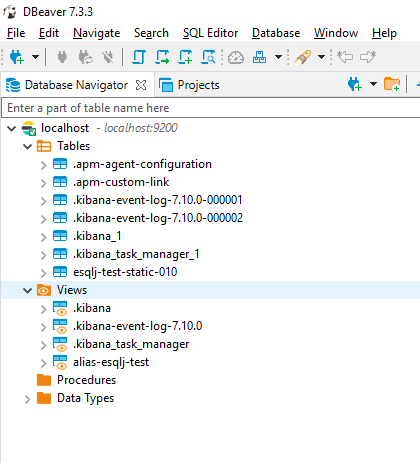
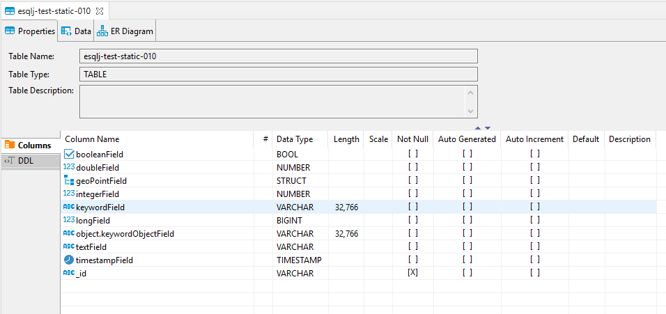
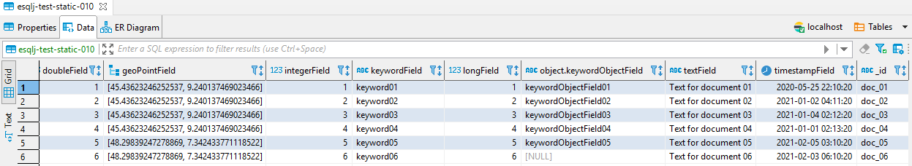
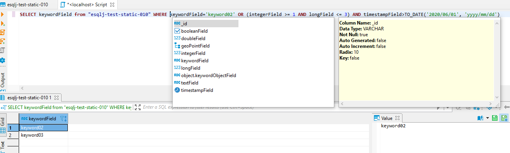

# esqlj-elastic-jdbc
**An open source JDBC driver for Elasticsearch released under Apache License 2.0**


esqlj doesn't use at all *SQL* Elastic implementation. Elastic integration is built on top of Elastic Rest High Level API (rel. 7.11). See Elastic licenses in folder `licenses/elastic-licenses`

esqlj introduce a new WHERE condition expression named `_esqlj` able to extend SQL Syntax with advanced Elastic query capabilities like full text queries, geo queries, shape queries, joining queries etc.

Sql parsing is provided by jsqlparser library [JSQLParser](https://github.com/JSQLParser/JSqlParser). See related licenses in folder `licenses/JSqlParser`

## Project status
Not production ready 

SQL Layers: partially implemented DQL.  
DDL and DML not implemented

## Driver class

### org.fpasti.jdbc.esqlj.EsDriver

JDBC Driver artifact isn't published on any public Maven repository

## JDBC Connections string

JDBC url must to follow this syntax:

```
jdbc:esqlj:http<s>://<elastic_address_1>:<elastic_port_1>,http://<elastic_address_2>:<elastic_port_2>,...;param1=paramValue1;...
```
It's possible to declare a pool of connections listing the url of Elastic instances separated by a comma.

Optional parameters:

| Name | Description | Default value
|--- |--- |---
| userName | Credential user name | -
| password | Credential password | -
| includeTextFieldsByDefault | Include text typed fields by default on select * | false
| indexMetaDataCache | Cache retrieved index structure. Select execution engine requires to know index / alias structure; retrieving these information it could be an heavy operation especially for alias or starred index query. Best choice to enable it on unmutable index | true
| maxGroupByRetrievedElements | Max GROUP BY retrieved elements for selected fields | 500
| queryScrollFromRows | Number of rows fetched on first pagination | 500
| queryScrollFetchSize | Fetched rows on next pagination | 500
| queryScrollTimeoutMinutes | Timeout between pagination expressed in minutes | 3
| queryScrollOnlyByScrollApi | If true, pagination will be executed by Elastic Scroll API. If false, it will be applied the scroll strategy that best fit the query (see Pagination paragraph below) | true
| sharedConnection | If true rest client will be statically shared between all connection (use it if you don't have the requirement to connect to different Elastic clusters inside same JVM) | true


## Concepts

Elastic indices are managed like SQL Tables.  
Elastic aliases are managed like SQL Views. 

Query on index / alias containing special characters like '*', '-', '.' need to be double quoted. For example 'SELECT * FROM ".test-index*"'  
Field and alias containing special characters like '-' must also to be double quoted.

Document identifier "_id" is returned like a column of type string in not aggregating query, and mapped on MetaData like primary key. This column is also available on Where condition for matching query (=, !=).  
Search score "_score" is returned like a colum of type float in not aggregating query.

'Like' SQL filter is implemented by Wildcard Elastic Query ([query-dsl-wildcard-query](https://www.elastic.co/guide/en/elasticsearch/reference/current/query-dsl-wildcard-query.html))

SQL filtering syntax is very limited. Esqlj supports a custom syntax for filtering documents using Elastic API full text queries, geo queries, shape queries...
Actually are implemented only a limited set of these advanced filtering query. This is an example of Query string full text search ([query-dsl-query-string-query](https://www.elastic.co/guide/en/elasticsearch/reference/current/query-dsl-query-string-query.html)):

`SELECT _id, _score FROM indexName WHERE _esqlj ::query_string('(new york city) OR (big apple) OR name:/joh?n(ath[oa]n)/', 'field1, field2,city.*', 'minimum_should_match:2') `

About SQL implementation see below section 'Support matrix and conventions'

By default the maximum number of document fields / columns that can be retrieved is set to 100.  
This explains - for example - because by default .kibana_* index containing almost 500 fields return an error on 'select *'.  
For increasing this configuration threshold change this Elastic setting according to your needs: 'index.max_docvalue_fields_search'

Change max doc threshold on indices that start with 'my-index':
```
PUT /my-index*/_settings
{
  "index" : {
    "max_docvalue_fields_search" : 500
  }
}
```

Change max doc threshold on all indices:
```
PUT /*/_settings
{
  "index" : {
    "max_docvalue_fields_search" : 500
  }
}
```

In the future there will no longer be possible query system indices.

Boolean fields in where clause: use constants `true` and `false` to express conditions on boolean typed columns.  For example:
``` SELECT * from \"esqlj-test-static-010\" WHERE booleanField=true ``` 

## DBeaver

A sample usage of esqlj in DBeaver:

  
*Tables are Elasticsearch indices. Views are Elasticsearch aliases*

  
*Fields in index*

  
*Document on index*


*Sample SQL query*

### How to configure DBeaver to use esqlj driver (without Elastic login)
- Create a new connection of type Elasticsearch
- Click "Edit Driver Settings"
- Change:
  - Class Name: `org.fpasti.jdbc.esqlj.EsDriver`
  - URL Template: `jdbc:esqlj:http://{host}:{port}`
  - Remove all jars and add `esqlj-<rel>.jar`
  - Click "OK" to confirm
- Change if required host and port and Test Connection
- OK

## Sample usage from Java

Add driver dependency in pom.xml:

``` 
<dependency>
	<groupId>org.fpasti</groupId>
	<artifactId>esqlj</artifactId>
	<version>0.2.0</version>
</dependency>
```
    
```
DriverManager.registerDriver(new EsDriver());
Connection connection = DriverManager.getConnection("jdbc:esqlj:http://localhost:9200");
Statement stmt = null;
ResultSet rs = null;

try {
	stmt = connection.createStatement();
	rs = stmt.executeQuery("SELECT * from \"esqlj-test-static-010\" WHERE booleanField=true");

	// print out column & fields
	ResultSetMetaData rsm = rs.getMetaData();
	for(int i = 1; i <= rs.getMetaData().getColumnCount(); i++) {
		System.out.println(String.format("%d: Column: %s, Column Alias: %s, Type: %s", i, rsm.getColumnName(i), rsm.getColumnLabel(i), rsm.getColumnTypeName(i)));
	}

	// iterate over query res
	while (rs.next()) {
		System.out.println(String.format("_id: %s : doubleField: %f - keywordField: %s - textField: %s - score: %f", rs.getString(10), rs.getDouble(2), rs.getObject(5), rs.getString(8), rs.getFloat(11)));
	}

} catch (SQLException ex) {
	System.out.println("SQLException: " + ex.getMessage());
} finally {
	if(stmt != null) {
		stmt.close();
	}
	if(connection != null) {
		connection.close();
	}
}
```
#### PreparedStatement actually unimplemented

## Types

Mapping of supported Elastic types to SQL types:

| Elastic on index type | Metadata declared SQL Type | Java effective type 
|--- |--- |---
| boolean | BOOL | Boolean
| date  | TIMESTAMP | LocalDateTime
| date_nanos | TIMESTAMP | LocalDateTime
| doc_id | VARCHAR | String
| double | NUMBER | Double
| flattened | STRUCT | Object
| float | NUMBER | Float
| geo_point | STRUCT | EsGeoPoint
| half_float | NUMBER | Float
| integer | NUMBER | Integer
| ip | VARCHAR | String
| keyword | VARCHAR | String
| long | BIGINT | Long
| object | STRUCT | Object
| scaled_float | NUMBER | Float
| short | NUMBER | Byte
| text | VARCHAR | String
| unsigned_long | NUMBER | Long
| wildcard | VARCHAR | String

## Pagination

By default esqlj implements a scrolling strategy on query through Elastic Scroll API. Optionally it's possibile to activate the less expensive scroll by order, but if you want to activate this functionality pay attention to include in every query a sorting on at least one tiebreaker field (in future it's no longer possible to query by doc id, it could be a best practice to store identifier also in document field).  It's in discussion an RFC on Elastic product about the introduction of an automatic tiebreaker in query result. But for now if you enable this feature and miss to add a sorting on a tiebreaker fields some rows could be skipped between paginations of data.

Still on the subject of scrolling by order, the driver doesn't use Point in Time API (it seems missing the support in Elastic Rest High level API). 

Pay attention: Scroll API consume resources on server. It's a best practice to fetch all required data as soon as possible. The scroll link will be automatically released from esql at the end of data retrieve.

## Testing
Most of test units require a live Elastic instance.  
The activation of these units is commanded by a system variable named "ESQLJ_TEST_CONFIG".  
The environment variabile must concatenate a valid esqlj JDBC url connection string and the load strategy of the documents requested by query inside units:

```
ESQLJ_TEST_CONFIG="jdbc:esqlj:http://<elastic_address>:<elastic_port>|<createAndDestroy or createOnly>
```

| Parameters | Actions | Scope
|--- |--- |---
| createAndDestroy | Test units create index 'esqlj-test-volatile-\<uuid\>' on start and delete it on finish | Continuous Delivery/Deployment
| createOnly | Test units create index 'esqlj-test-static-\<release.version\>' and not delete it on finish. If it's just present on Elasticsearch it will be preserved. (Will be required a manual delete of it from system).| Development stage

Sample configuration:
ESQLJ_TEST_CONFIG="jdbc:esqlj:http://10.77.154.32:9080|createOnly"

If ESQLJ_TEST_CONFIG isn't declared, all tests depending from live connection will be skipped. 

## Support matrix and conventions

### Select clause

Actually supported SELECT [...] element:

| Select element | Notes
|--- |--- 
| `column` | Elastic document field
| `column alias` or `column AS alias` | Alias for field in query result
| `*` | All document fields
| `_id` | document identifier (string)
| `_score` | document query search score (float)
| `TO_CHAR(field, mask_date)` | Format date field. Example: `TO_CHAR(timestampField, 'YYYY/MM/DD HH:MI:SS')`. Supported mask: YEAR, YYYY, YY, MM, MONTH, MON, DDD, DD, HH24, HH12, HH, MI, SS, DAY, XFF, FFF, FF, F, PM, TZR, TZH.

Supported query functions:

| Function | Description | Example 
|--- |--- |---
| `AVG` | Average of values | `SELECT AVG(integerField) FROM index`
| `COUNT` | Number of documents | Number of documents in index: `SELECT COUNT(*) FROM index`. Number of documents where `field` is present and not null: `SELECT COUNT(field) FROM index`, `SELECT COUNT(field), COUNT("object.keywordObjectField") FROM index`. 
| `SUM` | Sum of values | `SELECT SUM(integerField) FROM index`

#### Select Distinct

Is it possibile to query distinct values using `DISTINCT` clause.
Example:`SELECT DISTINCT keywordField, booleanField FROM index ORDER BY keywordField, booleanField DESC`

### Where condition

You can use both column name or column alias in expression.

| Expression condition | Notes
|--- |--- 
| `left expression` = `value` | 
| `left expression` != `value` | 
| `left expression` > `numeric_value` | 
| `left expression` >= `numeric_value` | 
| `left expression` < `numeric_value` | 
| `left expression` <= `numeric_value` | 
| `left expression` LIKE `expression` | Implemented by Wildcard Elasticsearch filter. See Elasticsearch documentation about its usage
| `left expression` IS NULL |
| `left expression` IS NOT NULL |
| `left expression` BETWEEN `a` AND `b` | `a` and `b` could be NUMBER, STRING, date expressed by TO_DATE('date', 'mask_date'), EXTRACT function
| `left expression` IN (`value1`, `value2`, ...) |
| `_esqlj ::query_type('param1','param2',...)` | Elastic raw query. See below for reference

#### Admitted left expression

| Expression
|--- 
| `column`
| `alias`
| EXTRACT(`period` from `column`)

`value`=`column` expression is for example considered invalid from esqlj

#### _esqlj

`_esqlj` expression allows you to invoke specific Elastic query API.  
Syntax usage is `_esqlj` `query_type`(`param1`,`param2`,...), where `query_type` maps specific Elastic query, and `param1`,`param2`,... allows you to pass parameters to that query.  
Typically `param1` is the search criteria and `param2` is the column involved in the query. Other parameters are optionals and change according different query types. For example `analyze_wildcard`, `fuzzy_max_expansions` etc. These configuration settings must to be declared in this way:
`_esqlj query_string('search criteria','field1,field2,object.*','analyze_wildcard:true','fuzzy_max_expansions:15')`.
Esqlj will dynamically cast params value type according to expected parameter Elastic query object.

Currently implemented raw Elastic queries:

| Elastic query | query_type | Parameters | Elastic reference
|--- |--- |--- |--- 
| Query string | query_string | 1: query expression, 2: search on fields (* for all), 3..x: additional query parameters (see Elastic documentation)| [query-dsl-query-string-query](https://www.elastic.co/guide/en/elasticsearch/reference/current/query-dsl-query-string-query.html)

*_esqlj samples*

| Query type | Sample
|--- |--- 
| Query string | ```SELECT id, _score FROM indexName WHERE _esqlj ::query_string('(new york city) OR (big apple) OR name:/joh?n(ath[oa]n)/', 'field1, field2,city.*', 'minimum_should_match:2')```

#### Functions

| Function name | Admitted on | Notes
|--- |--- |--- 
| `SYSDATE` | Right expression | Current date time
| `SYSDATE()` | Right expression | Current date time
| `NOW()` | Right expression | Current date time
| `GETDATE()` | Right expression | Current date time
| `TRUNC(SYSDATE\|SYSDATE())` | Right expression | Current date
| `TO_DATE(date, mask_date)` | Right expression | Supported mask: YEAR, YYYY, YY, MM, MONTH, MON, DDD, DD, HH24, HH12, HH, MI, SS, DAY, XFF, FFF, FF, F, PM, TZR, TZH. Example TO_DATE('2020/01/01', 'YYYY/MM/DD')
| `EXTRACT(PERIOD FROM column)` | Left expression |PERIOD can be valued with `YEAR`, `MONTH`, `DAY`, `HOUR`, `MINUTE`, `SECOND`. Usage example: EXTRACT(YEAR FROM timestamp)!=2020

### Group by

Is it possible to aggregate values using GROUP BY clause. 
Example: `SELECT booleanField, AVG(integerField) test, SUM(longField), COUNT(doubleField), COUNT(*) from testIndex GROUP BY booleanField`

### Having

Is it possible to apply filtering on Group by function.
Example: `SELECT booleanField, AVG(integerField) test, SUM(longField), COUNT(*) from testIndex GROUP BY booleanField HAVING AVG(integerField)>=4 OR SUM(longField)>=19`

### Order

Example:
SELECT * FROM `column` ORDER BY keywordField, integerField DESC

### Limit

Example:
SELECT * FROM `column` LIMIT 100


## Compatibility

Tested on 7.4.2 and 7.10.0 Elasticsearch release

## About me
Fabrizio Pasti  
[fabrizio.pasti@gmail.com](mailto:fabrizio.pasti@gmail.com)  
[https://www.linkedin.com/in/fabrizio-pasti-2340a627](https://www.linkedin.com/in/fabrizio-pasti-2340a627)

